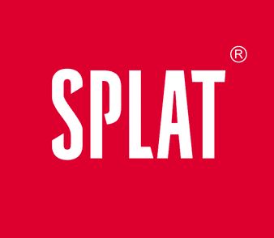

<h1 align="center">Сергей Володин 👋</h1>
<h3 align="center">Frontend-разработчик | Bitrix24 & BI-инструменты</h3>

Создаю интерфейсы, отчёты, дашборды и интеграции, которые помогают бизнесу принимать решения на основе данных

<h2>Обо мне</h2>

Frontend-разработчик с <b>4+ годами опыта</b>.

Работал над проектами для:

<table>
<tr>

<td align="center" width="120">
<a href="https://alfabank.ru" target="_blank">
   
  <b>Альфа-Банк</b>
</a>
</td>

<td align="center" width="120">
<a href="https://indrive.com" target="_blank">
   
  <b>InDrive</b>
</a>
</td>

<td align="center" width="120">
<a href="https://splat.global" target="_blank">
   
  <b>Splat Global</b>
</a>
</td>

</tr>
</table>

Последний год занимаюсь разработкой <b>инструментов аналитики, дашбордов и интеграций для Bitrix24 </b>.

<h2>Чем занимаюсь</h2>
<ul>
<li>Разработка аналитических отчётов и BI-инструментов</li>
<li>Интеграции через REST API и Bitrix24 API</li>
<li>Создание интерфейсов под бизнес-задачи</li>
<li>Оптимизация процессов визуализации данных</li>
</ul>

<h2>Технологии</h2>

<h3>Frontend</h3>
<table>
<tr>
<td align="center" width="110">
 
<b>Vue 3</b>
</td>

<td align="center" width="110">
 
<b>Nuxt 4</b>
</td>

<td align="center" width="110">
 
<b>TypeScript</b>
</td>

<td align="center" width="110">
 
<b>JavaScript</b>
</td>
</tr>
</table>

<h3>Сборка и тестирование</h3>
<table>
<tr>
<td align="center" width="110">
   
  <b>Vite</b>
</td>

<td align="center" width="110">
   
  <b>Vitest</b>
</td>

<td align="center" width="110">
   
  <b>Jest</b>
</td>
</tr>
</table>

<h3>Интеграции и API</h3>

Интеграции с внешними сервисами и автоматизация бизнес-процессов

<table>
<tr>

<td align="center" width="120">
 
<b>Bitrix24</b>
</td>

<td align="center" width="120">
 
<b>UniSender</b>
</td>

</tr>
</table>

<h3>Контроль версий и репозитории</h3>

<table>
<tr>
  <td align="center" width="110">
     
    <b>Git</b>
  </td>

  <td align="center" width="110">
     
    <b>GitHub</b>
  </td>

  <td align="center" width="110">
     
    <b>GitLab</b>
  </td>
</tr>
</table>

<h2>Проекты</h2>

Примеры реализованных решений и аналитических инструментов для Bitrix24. Список будет пополняться новыми кейсами:

<ul>

<li>
<b>Контроль трудозатрат и загрузки команды</b> — прозрачная аналитика по задачам сотрудников, выявление перерасхода времени и проблемных задач. 
<a href="https://github.com/volodin7ergey/bitrix24-time-tracking" target="_blank">🔗 Перейти к проекту</a>
</li>

 

<li>
<b>Аналитика продаж и прибыли по компаниям</b> — суммарные показатели сделок, прибыль и эффективность работы с клиентами за выбранный период. 
<a href="https://github.com/volodin7ergey/bitrix24-company-revenue" target="_blank">🔗 Перейти к проекту</a>
</li>

 

<li>
<b>Рейтинг сотрудников отдела продаж</b> — сравнительная таблица показателей по продажам, рост или снижение результатов, наглядная визуализация. 
<a href="https://github.com/volodin7ergey/bitrix24-employee-sales-analytics" target="_blank">🔗 Перейти к проекту</a>
</li>

 

<li>
<b>Контроль качества данных</b> — поиск проблемных сущностей, где отсутствуют ключевые поля, с возможностью фильтрации по типу и периоду. 
<a href="https://github.com/volodin7ergey/bitrix24-data-quality-report" target="_blank">🔗 Перейти к проекту</a>
</li>

 

<li>
<b>Другие проекты и эксперименты</b> — новые отчёты и аналитические инструменты в разработке.
</li>

</ul>

Каждый проект демонстрирует подход к решению прикладных задач и работе с данными.

<h2>Контакты</h2>

Всегда рад обсудить проекты, идеи или поделиться опытом в Bitrix24 и веб-разработке

